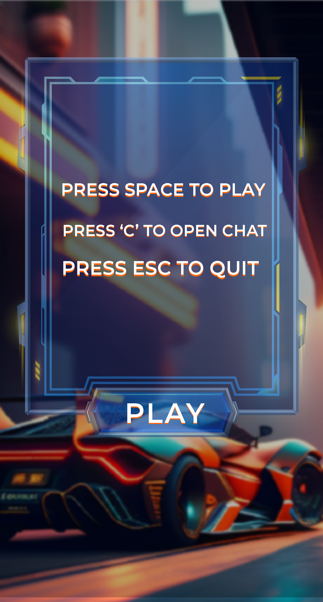

# Car-Racer 🚗 -Distributed-Computing-Project 

Car Racer is a fast-paced racing game where players compete to achieve the highest score. Dodge obstacles and enemy drivers to become the ultimate champion.
# Gameplay overview 🎮 
Players enter the game lobby and click the spacebar to play, then they wait for the other player to join the game. Once both players have joined, they start the race together and try to avoid collisions with enemy cars to increase their score.

The game also features a chat room that players can access at any time by pressing the "C" button before or during the game.

If a player collides with an enemy car, they lose the race and the other player wins. However, they can play again without having to exit the game.

The race continues until one of the players reaches the finish line, and the winner is declared
# Controls

<ul>
  <li>Arrow Up: Move Forward</li>
  <li>Arrow Down: Move Downward</li>
  <li>Arrow Right: Move Right</li>
  <li>Arrow Left: Move Left</li>
</ul>

# Screenshots 📷

| Screenshot 1 | Screenshot 2 | Screenshot 3 |
|--------------|--------------|--------------|
|  |  |  |
# Demo 🎥

# Getting Started 💻

<ol>
  <li>Install pycharm Compiler or any python compiler </li>
  <li>install pygame library</li>
  <li>Run server.py</li>
  <li>Run game & chat.py</li>
</ol>

# Important Note 📝
# Included Libraries 📚
# Have Fun! 🚀
